# Dicegame
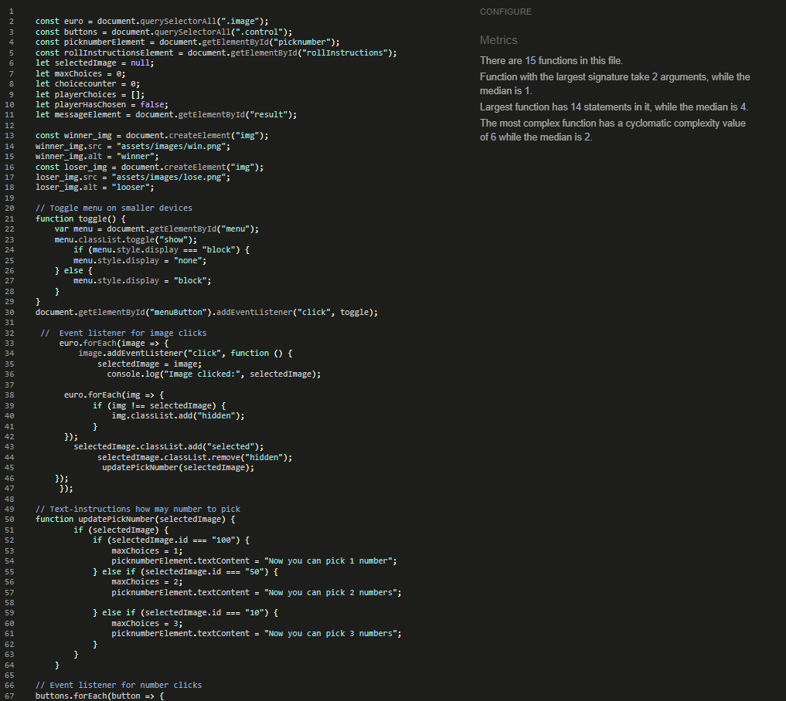

https://christina5p.github.io/Dicegame/

### Content

* [Project Set Up](#project-set-up)
* [Project Feature](#feature)
* [Project Future Features to Implement](#future-features-to-implement)
* [Project Design](#design)
* [Project Deployment](#deployment)
* [Project Bugs](#bugs)
* [Project Test](#test)
* [Project Source References](#source-reference)
* [Project Mentions](#mentions)
* [Project Acknowledgement](#acknowledgement)

Dicegame is a game for a quick bet.

If you like numbers, dicegame and bets, this is a simple game to play.

You choose if you want to bet 10, 50 or 100 euro by click on the bill.
The higher you bet, the more risk you take! 
After your bet, you choose numbers regarding your bet. If you bet 10 euro, you choose 3 numbers, for 50 euro you get 2 numbers and 100 euro you get 1 number.

After you have bet and clicked on numbers, you click to roll a dice.
The dice will show you the result and if you have the number in your choices, you win the bet. Otherwise you lose.

The idea is taken from the betwheel at the fairground.

## Feature

Features

### Play

To start you bet from 3 different values and you can easily see your bet, since the other values dissapear after your choice. 

When you have bet, you get informed how many numbers you will click on and your click change colours, so you can see your choice.
If you try to pick number before betting, you get an alert

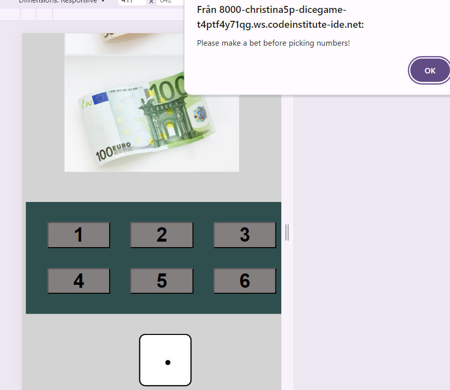

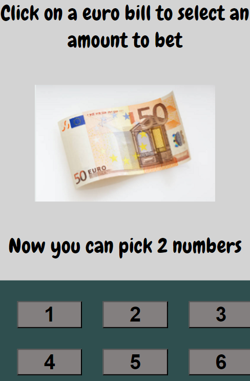

When you have choosed numbers, you are ready to roll the dice by clicking on it.
If you try to roll the dice before picking all the numbers, you get an alert.

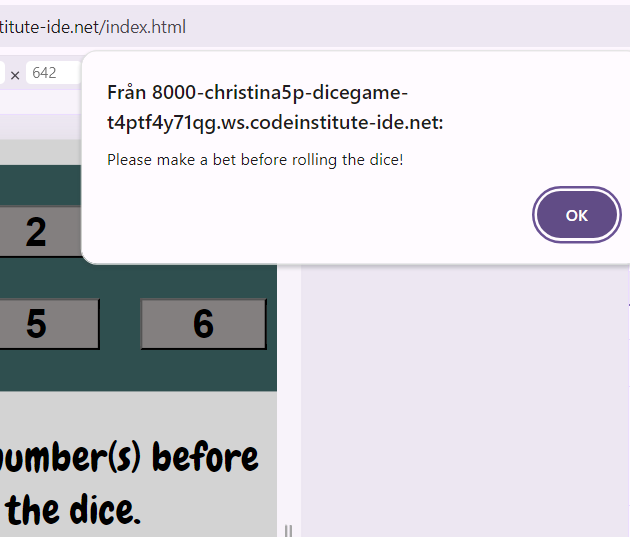

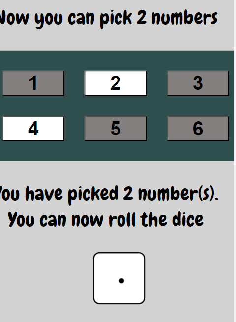

After that, you click on the dice to get it roll.
The dice will roll with the animations and generate a number to compare if it is the same number you have choosen.
f you win, you should feel like the jumping man with the green dice that pops up and you get a result with the value you win.

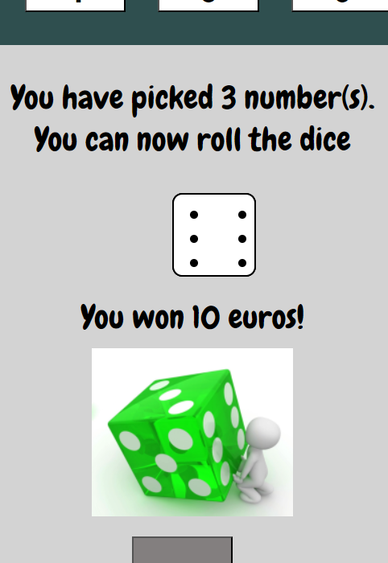

And it´s harder feeling to lose, but make it a new try with the pulling man.
After your play you can easily click the "play again" button to restart the game.

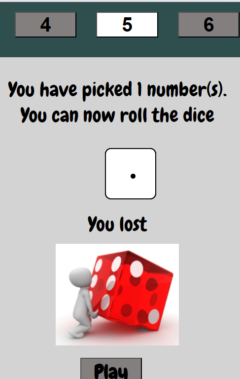

### Instructions

There is a page with instructions, and you can switch between play and instructions in the navbar.

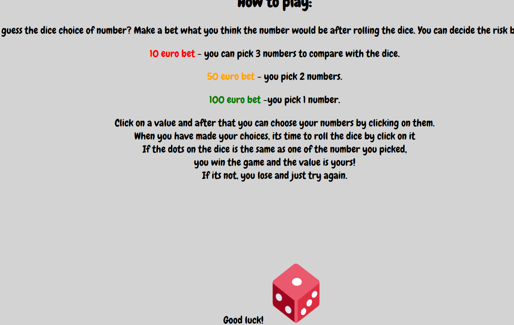

### Navbar

On top there is a navbar for Play and Instructions.
An smaller decices, there is an icon instead and when you click on the menuicon, you see the navbar.

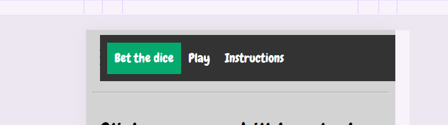

### Footer 
A copyright of the game creator.

## Future Features to Implement

Counter how many rolls you need to reach a specific value (/or for ex. 24 points).
A counter to add your bet (/or the dice number) for every times you win and count how many rolls you need to reach 24.

* Best score
On right hand side tha game will represent a best score list. 

## Design

* Font: Chewy
* Background color is grey in different shadows

## Deployment
The site was created from Gitpod and is continuing push to GitHub.
Readme is written in Gitpod.
 The codes I´ve been using is git pull / git add . / git commit -m"" / git push.

The site was deployed to GitHub pages. The way I manage that:

* Navigate to my repository
* From the setting tab (above the repository) click setting tab.
* Select Pages in the left-hand menu
* Section Build and deployment- source select Deploy from a branch
* Select main in first area and root in second area
* Save
* You 

## Bugs 

Bugs

Bugs derived to my first submission:

* The dots on the dice. It was hard to get them in position and get them to stay inside the dice.
 The resolution was to change the position od dots in css.

* To get the result if you won or lost by comparing the dice number with those number you have choosen.
 I got stock since a thought I had enough function for both above but I solved it to make one more function with InternalDiceroll.

* Every time I loaded the sight I got error, even if the function worked.
  It was confusing, but I had 2 html and JS script was calling from first page and didn´t got answer since that page didn´t have content JS was calling.

* The animation of dice was hard to get through, but the tutor lesson https://www.youtube.com/watch?v=XTF5jXDr2H8 helped me out of that one.

Bugs for this submission:

* I used winner and loservideos, but even if I stopped them in the codes by "loop=false", " ended" it didn´t work.
I also checked the video raw, so it wasn´t repeating.
In the end I decidecd to use a picture instead, so you don´t get annoyed of a continuing video.

* The navbar on smaller screens doesn´t work in instructions page.

## Test 

Testing

### HTML Validator
I have checked the HTML codes through https://validator.w3.org.

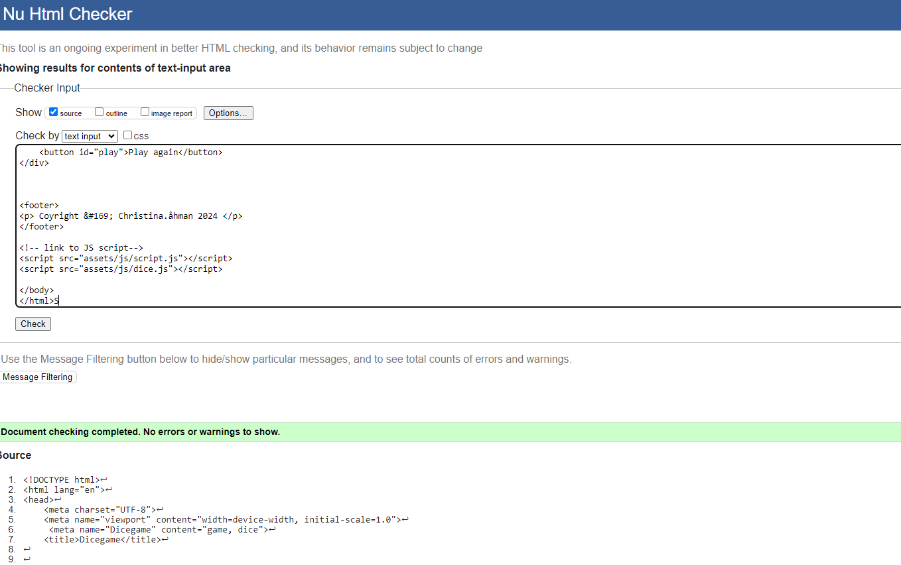

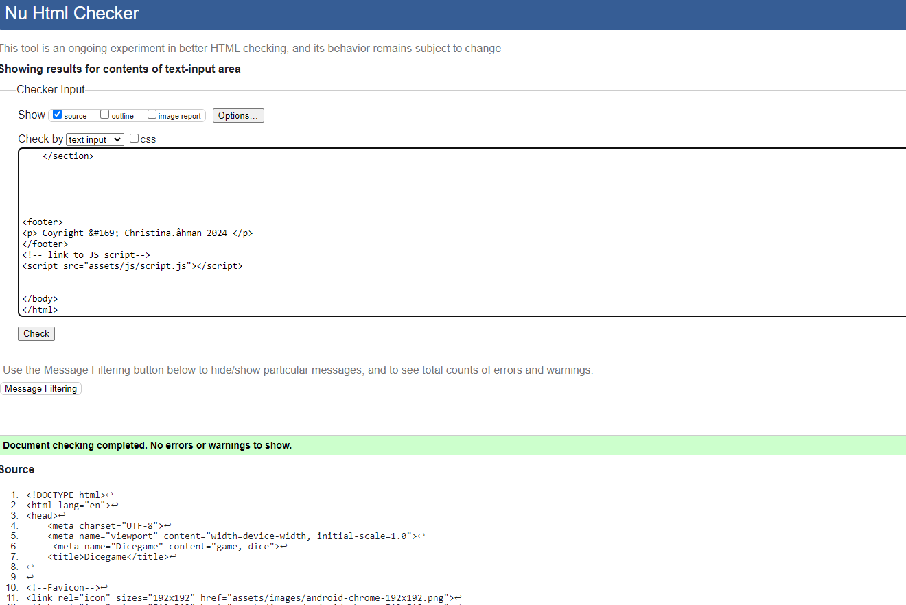

### CSS Validator 
I have checked css code through https://jigsaw.w3.org/css-validator/#validate_by_input.

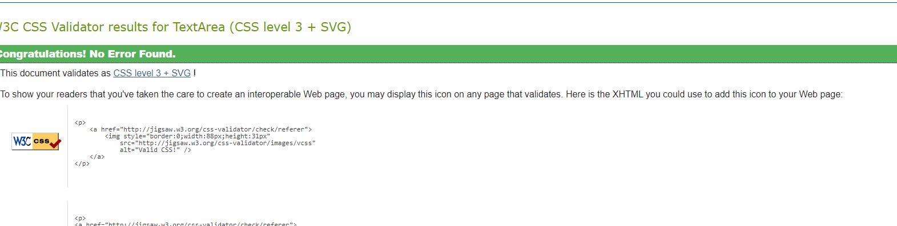
99
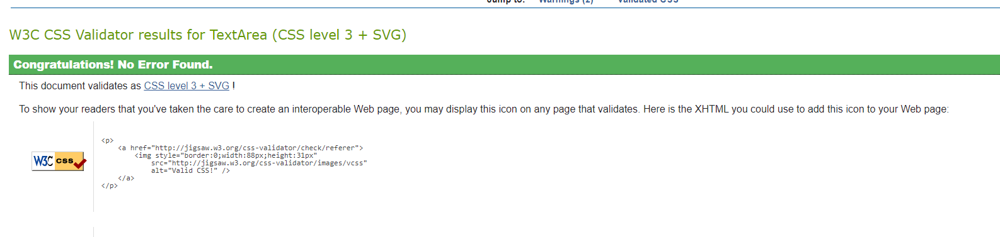

### JS Hint
I have checked JS codes through https://jshint.com/

### Responsiveness
I have checked responsiveness through https://ui.dev/amiresponsive?url=https://christina5p.github.io/Dicegame/

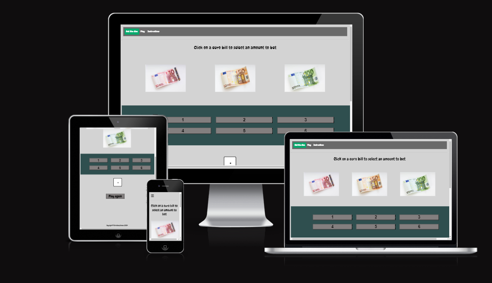

### Lighthouse

###

## Source reference:
 * https://medium.com/@mintholic1/use-google-fonts-to-style-your-javascript-app-a74c6d21147a - insiration of fonts
 * https://www.w3schools.com/howto/tryit.asp?filename=tryhow_js_mobile_navbar_hor -tutoring responsive navbar
 * https://www.youtube.com/watch?v=t0CdtUEzfLo _tutoring 3D dice
 * https://www.veed.io/login - compress video
 * https://www.w3schools.com/js/tryit.asp?filename=tryjs_alert - tutoring alerts
 * https://chatgpt.com/ - help me to explain my code when I get errors
 * https://videojs.com/guides -tutoring to stop the videoloop
 * https://stackoverflow.com/ - tutoring reset games
 * https://www.w3schools.com/jsref/met_loc_reload.asp
 * https://balsamiq.com/  - Build the skeleton
 * https://www.canva.com/ -Pictures when you win or loose
 * https://www.istockphoto.com/se/collaboration/boards/aErC0W69g0if3TpFdJwx6Q -Pictures of euro
 *-https://betterprogramming.pub/creating-dice-in-flexbox-in-css-a02a5d85e516 -Tutoring/inspiration to create dice with dots with css
 * https://stackoverflow.com/questions/52540974/ show-dice-element-corresponding-to-random-number-generated-on-click -
 Tutoring dots on dice
 * https://www.youtube.com/watch?v=M3InbHr0WAc -Tutoring dots on dice
 * https://codebeautify.org/jsvalidate# Tutoring dots on dice
 * ChatGPT -To get codes explained in Swedish
 * https://www.perplexity.ai/ - Troubleshout/explanation of written codes
 * https://chat.openai.com/ To get help with suggestion when I debug functions text.content
 * https://dcod*e.domenade.com/tutorials/how-to-create-a-dice-roll-game-with-html-css-and-javascript -Tutoring dice and dots
 * https://www.kiltedviking.net/se/www/javascript/dom1.html - Repetition(tutoring) of DOM
 * https://github.com/bradtraversy/btre_project/issues/9  -Troubleshot url-problems
 * Tutoring lesson with Ernst, Digitala lyftet
 * CI Tutor to help to me understand function "checkAnswer"
 * https://www.youtube.com/watch?v=Fw3jE0tWn28  - Tutoting change colour on buttons
 * https://www.w3schools.com/jsref/met_document_getelementsbyclassname.asp - To teach how to call back information
 * https://www.geeksforgeeks.org/javascript-nested-functions/
 * https://www.tutorialspoint.com/javascript/javascript_nested_functions.htm  - To tech me about nested functions
 * https://codedamn.com/news/javascript/how-to-empty-an-array-in-javascript  Tutoring how to clear arrays
 * https://developer.mozilla.org/en-US/docs/Web/API/Element/remove -Tutoring remove element
 * https://stackoverflow.com/questions/3087975/how-to-change-the-cursor-into-a-hand-when-a-user-hovers-over-a-list-item
   To get cursor properties
 * https://www.w3schools.com/cssref/css3_pr_mediaquery.php -responsive check to css
 * https://www.w3schools.com/howto/howto_js_scroll_to_top.asp - Tutoring scroll up the window
 * https://stackoverflow.com/questions/69427603/autoplay-on-video-is-not-working-after-refreshing-page
   - Investigate video autoplay
 * https://www.youtube.com/watch?v=XTF5jXDr2H8 - Tutoring and help me with codes for dice animation
 * https://www.w3schools.com/jsref/tryit.asp?filename=tryjsref_loc_reload -Tutor to reload the game

## Mentions

This is a resubmission of my PP2 project.
I decided to start over with a new repository and the codes from start.
That was very educational for me, since I got repeat and could see the project whith "new eyes"  
I used the same idea of project and base and just changed some styling.
Focus has been on consistent code and cover up any chance for user to missunderstand the game.
I renamed it to Dicegame instead my old repository: https://github.com/Christina5P/are-you-a-dice-player

## Acknowledgement 

As my first project, I have been supported from my mentor and studyfellows and friends.